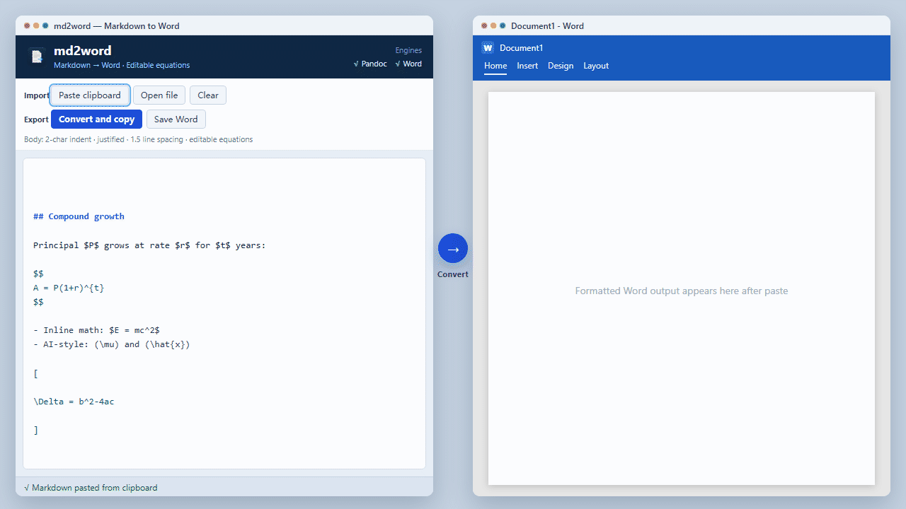

# md2word

**English** | [简体中文](README.zh-CN.md)

[](https://github.com/wanxiao2018/md2word/actions/workflows/ci.yml)
[](LICENSE)
[](https://www.python.org/)
[](https://linux.do)

Turn Markdown copied from ChatGPT, Claude, Cursor, and similar tools into Word-ready rich text, `.docx`, or **PDF**. Equations are converted to editable Word formulas (OMML) when possible.



Conversion runs entirely on your machine. Nothing is uploaded. The source runs on **Windows, macOS, and Linux**.

## Features

- **Convert and copy**: native Word content (including editable equations) so paste keeps formatting
- **Save as .docx** / **convert and open in Word**
- **Export PDF** (requires Microsoft Word or LibreOffice)
- **Paste from clipboard**, with optional clipboard watching and auto-convert
- Body styling: first-line indent of 2 characters, justified alignment, 1.5 line spacing
- Strips Markdown section rules (`---`)
- Recognizes messy AI math such as `(\mu)` and bracket-wrapped LaTeX blocks
- Prefers local [Pandoc](https://pandoc.org/); falls back to the built-in converter

## Typical workflow

1. Copy Markdown from an AI tool
2. Open md2word → **Paste clipboard** (`Ctrl+Shift+V` on Windows, `⌘⇧V` on Mac)
3. **Convert and copy** (`Ctrl+Enter` / `⌘Enter`)
4. Paste into Word (`Ctrl+V` / `⌘V`)

Or enable **Watch clipboard + auto-convert**, then paste directly in Word.

Sample input: [`examples/sample.md`](examples/sample.md) and [`examples/ai-math.md`](examples/ai-math.md).

## Shortcuts

| Windows | macOS | Action |
|---------|-------|--------|
| `Ctrl+Shift+V` | `⌘⇧V` | Paste from clipboard |
| `Ctrl+Enter` | `⌘Enter` | Convert and copy |
| `Ctrl+S` | `⌘S` | Save as .docx |
| `Ctrl+P` | `⌘P` | Export PDF |
| `Esc` | `Esc` | Clear the editor |

## Install and run

Requires Python 3.10+. [Pandoc](https://pandoc.org/installing.html) is recommended. With Microsoft Word installed, equations are copied as editable Word formulas; otherwise the app falls back to rich HTML. PDF export needs Word or [LibreOffice](https://www.libreoffice.org/).

### Windows

```bat
pip install -r requirements.txt
python main.py
```

Or double-click `start.bat`.

Build a single-file exe:

```bat
pip install -r requirements-dev.txt
python build_exe.py
```

Output: `dist\md2word.exe` (~18 MB). Add it to antivirus exclusions if it is flagged.

### macOS / Linux

```bash
python3 -m pip install -r requirements.txt
python3 main.py
```

Or:

```bash
chmod +x start.sh
./start.sh
```

On macOS you can install Pandoc with Homebrew: `brew install pandoc`.

## Tests

```bash
python -m unittest tests.test_md2word -v
```

Cases that need Pandoc or Word are skipped when those tools are missing.

## Layout

```
md2word/
  main.py              # entry point
  start.bat            # Windows launcher
  start.sh             # macOS / Linux launcher
  build_exe.py         # Windows packager
  md2word/
    converter.py       # Markdown → docx / html / pdf
    clipboard.py       # cross-platform clipboard
    clipboard_win.py   # Windows rich clipboard
    mathprep.py        # wrap AI math in TeX delimiters
    docxstyle.py       # Word body styles
    wordcom.py         # Word copy / PDF (COM / AppleScript)
    gui.py             # desktop UI
  examples/            # sample Markdown
  assets/              # app icon
  docs/demo.gif        # README demo (English)
  tests/               # unit tests
```

Default export folder: `Documents/md2word/`.

## Community

md2word acknowledges and is shared with the [LINUX DO](https://linux.do/) community.

- [LINUX DO](https://linux.do/) — discussion, feedback, and Chinese-speaking users
- [GitHub Issues](https://github.com/wanxiao2018/md2word/issues) — bug reports

## Contributing

See [CONTRIBUTING.md](CONTRIBUTING.md). Issues and pull requests are welcome.

## License

[MIT](LICENSE)
