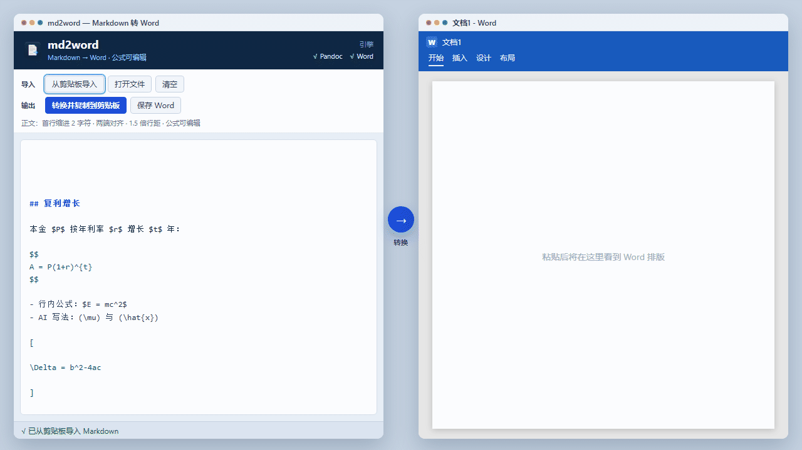

# md2word

[English](README.md) | **简体中文**

[](https://github.com/wanxiao2018/md2word/actions/workflows/ci.yml)
[](LICENSE)
[](https://www.python.org/)

把 ChatGPT、Claude、Cursor 等 AI 工具复制出来的 **Markdown** 转成 Word 可识别的富文本、`.docx` 或 **PDF**。公式会尽量变成可编辑的 Word 公式（OMML）。



本工具只在本地转换，不上传任何内容。源码可在 **Windows、macOS、Linux** 上运行。

## 功能

- **转换并复制到剪贴板**：生成 Word 原生内容（含可编辑公式），粘贴到 Word 时保留格式
- **保存为 .docx** / **转换并打开 Word**
- **导出 PDF**（需要 Microsoft Word 或 LibreOffice）
- **从剪贴板导入** Markdown，可监视剪贴板并自动转换
- 正文自动排版：首行缩进 2 字符、两端对齐、1.5 倍行距
- 去掉 Markdown 分节横线（`---`）
- 识别 AI 常见的不规范公式写法，例如 `(\mu)`、方括号包住的 LaTeX 块
- 优先使用本机 [Pandoc](https://pandoc.org/)；没有则回退到内置转换器

## 推荐流程

1. 在 AI 软件中复制 Markdown
2. 打开 md2word → **从剪贴板导入**（Windows：`Ctrl+Shift+V`，Mac：`⌘⇧V`）
3. **转换并复制到剪贴板**（Windows：`Ctrl+Enter`，Mac：`⌘Enter`）
4. 打开 Word，粘贴（Windows：`Ctrl+V`，Mac：`⌘V`）

也可以开启 **监视剪贴板 + 自动转换**，复制后直接去 Word 粘贴。

示例输入见 [`examples/sample.zh-CN.md`](examples/sample.zh-CN.md) 和 [`examples/ai-math.zh-CN.md`](examples/ai-math.zh-CN.md)。

## 快捷键

| Windows | macOS | 作用 |
|---------|-------|------|
| `Ctrl+Shift+V` | `⌘⇧V` | 从剪贴板导入 |
| `Ctrl+Enter` | `⌘Enter` | 转换并复制到剪贴板 |
| `Ctrl+S` | `⌘S` | 保存为 .docx |
| `Ctrl+P` | `⌘P` | 导出 PDF |
| `Esc` | `Esc` | 清空编辑区 |

## 安装与运行

环境：Python 3.10+。建议同时安装 [Pandoc](https://pandoc.org/installing.html)。有 Microsoft Word 时，公式会按 Word 可编辑公式复制到剪贴板；没有 Word 时会回退到 HTML 富文本。导出 PDF 需要 Word 或 [LibreOffice](https://www.libreoffice.org/)。

### Windows

```bat
pip install -r requirements.txt
python main.py
```

或双击 `start.bat`。

打包 exe：

```bat
pip install -r requirements-dev.txt
python build_exe.py
```

产物：`dist\md2word.exe`。单文件约 18 MB；杀毒软件偶发误报时可添加信任。

### macOS / Linux

```bash
python3 -m pip install -r requirements.txt
python3 main.py
```

或：

```bash
chmod +x start.sh
./start.sh
```

macOS 可用 Homebrew 安装 Pandoc：`brew install pandoc`。

## 测试

```bash
python -m unittest tests.test_md2word -v
```

未安装 Pandoc 或 Word 的用例会自动跳过。

## 项目结构

```
md2word/
  main.py              # 入口
  start.bat            # Windows 启动
  start.sh             # macOS / Linux 启动
  build_exe.py         # Windows 打包脚本
  md2word/
    converter.py       # Markdown → docx / html / pdf
    clipboard.py       # 跨平台剪贴板
    clipboard_win.py   # Windows 富文本剪贴板
    mathprep.py        # 把 AI 公式包装成 TeX 定界符
    docxstyle.py       # Word 正文样式
    wordcom.py         # Word 复制 / 导出 PDF（Windows COM / macOS AppleScript）
    gui.py             # 图形界面
  examples/            # 示例 Markdown
  assets/              # 应用图标
  docs/demo.gif        # 英文 README 演示动图
  docs/demo.zh-CN.gif  # 中文 README 演示动图
  tests/               # 单元测试
```

默认导出目录：`文档/Documents/md2word/`。

## 参与贡献

见 [CONTRIBUTING.md](CONTRIBUTING.md)（英文）或 [CONTRIBUTING.zh-CN.md](CONTRIBUTING.zh-CN.md)。欢迎提 Issue 和 Pull Request。

## 许可证

[MIT](LICENSE)
